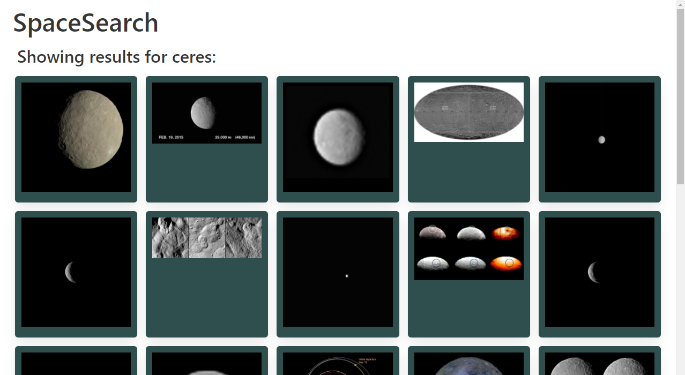

# SpaceSearch

## Description
A website where you can search through NASA's Image and Video Library. When you type in a search query and click "search", you get a page of all the results NASA's Images and Videos Library API could find, up to 100. You can save search results to your favorites, and see them later by clicking on the Favorites tab.

## Technologies Used
For the CSS framework, we chose to use Bulma. We liked how clean it looked, and how verbose the class names are. For APIs, we chose NASA's Image and Video Library API, and NASA's Astronomy Picture Of the Day API.

## Link
[Click here to see the finished site.](https://jcpickens0215.github.io/SpaceSearch/)

## Screenshot

## License
The MIT License (MIT)
Copyright © 2021 Justin Pickens

Permission is hereby granted, free of charge, to any person obtaining a copy of this software and associated documentation files (the “Software”), to deal in the Software without restriction, including without limitation the rights to use, copy, modify, merge, publish, distribute, sublicense, and/or sell copies of the Software, and to permit persons to whom the Software is furnished to do so, subject to the following conditions:

The above copyright notice and this permission notice shall be included in all copies or substantial portions of the Software.

THE SOFTWARE IS PROVIDED “AS IS”, WITHOUT WARRANTY OF ANY KIND, EXPRESS OR IMPLIED, INCLUDING BUT NOT LIMITED TO THE WARRANTIES OF MERCHANTABILITY, FITNESS FOR A PARTICULAR PURPOSE AND NONINFRINGEMENT. IN NO EVENT SHALL THE AUTHORS OR COPYRIGHT HOLDERS BE LIABLE FOR ANY CLAIM, DAMAGES OR OTHER LIABILITY, WHETHER IN AN ACTION OF CONTRACT, TORT OR OTHERWISE, ARISING FROM, OUT OF OR IN CONNECTION WITH THE SOFTWARE OR THE USE OR OTHER DEALINGS IN THE SOFTWARE.

## Contact
You can e-mail me at: justin.pickens.1994@gmail.com
