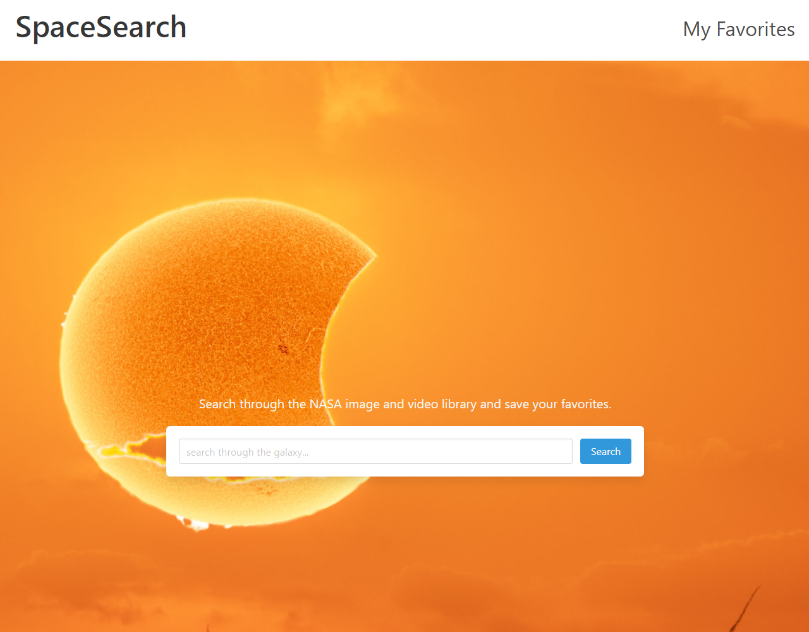

# SpaceSearch

## Description
A website where you can search through NASA's Image and Video Library. When you type in a search query and click "search", you get a page of all the results NASA's Images and Videos Library API could find, up to 100. You can save search results to your favorites, and see them later by clicking on the Favorites tab.

## Technologies Used
For the CSS framework, we chose to use Bulma. We liked how clean it looked, and how verbose the class names are. For APIs, we chose NASA's Image and Video Library API, and NASA's Astronomy Picture Of the Day API.

## Link
[Click here to see the finished site.](https://jcpickens0215.github.io/SpaceSearch/)

## Screenshot

